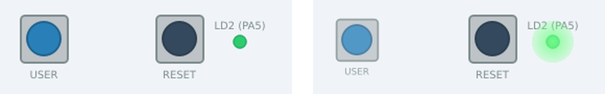
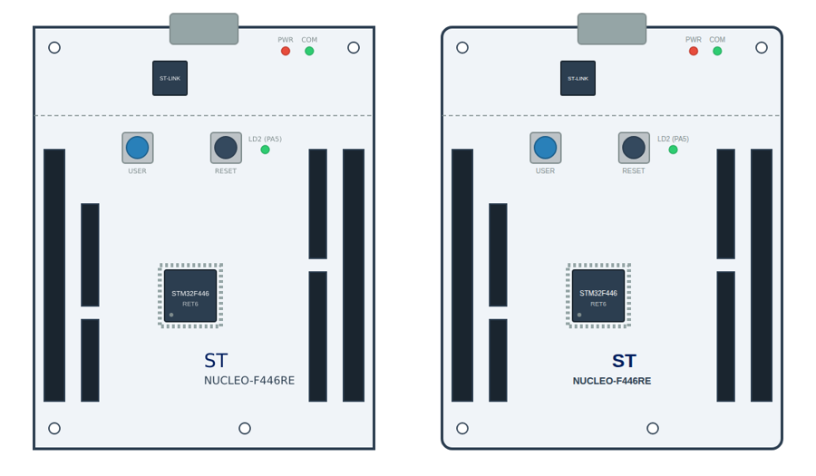

# Cada placa con su dibujo: ilustraciones SVG en `mcu-sim-gui`

*Análisis del 2026-10-06. Lo que cambia en `mcu-sim` está en su
`doc/analisis-uso-ilustraciones.md`; aquí está todo lo demás.*

> **Estado.** Decidido el 2026-10-06 (§14): se localiza **por id y por la tabla
> de enlaces** del XML, sin atributos propios en el SVG por ahora (si llegan,
> su espacio de nombres será `mcusim`); la ilustración **no sustituye** al
> panel —si hay dibujo se enseña ella, y el panel sigue a la vista—; y los
> dibujos **viajan con la placa**, sin biblioteca propia en la ventana.
> **Hechas las fases 1 a 6** (§13): plan §21 a §26. De la 6, lo que se pidió:
> las placas **una al lado de otra**, con líneas entre los conectores; las
> placas apiladas quedan para otro día. La 4, sin biblioteca
> propia y sin atributos `mcusim:`, como se decidió: el dibujo lo manda
> `mcu-sim` (`T_ILUSTRACION`) y la tabla de enlaces llega en `T_PLACA`.
> Después (plan §27), la ilustración dejó de ser una pestaña junto al panel:
> va en **su propia ventana**, para aprovechar mejor la pantalla.

## 1. La pregunta

Hoy la ventana pinta cada placa como una rejilla de recuadros, uno por pieza
(plan §3 y §19). La idea es enseñar además una **representación visual
aproximada de cada placa**, hecha con un fichero SVG —la de ejemplo es una
NUCLEO-F446RE dibujada a mano—, y que durante la simulación **los observables
y los mandos aparezcan sobre la imagen o la modifiquen**: el LED de usuario que
cambia de intensidad al encenderse y apagarse, el botón que se ve hundido y se
pulsa con el ratón sobre el dibujo.

Hay que decidir:

* cómo se pinta un SVG en la ventana y cómo se le cambia el aspecto en marcha;
* cómo se **localiza en el dibujo cada pieza** del circuito;
* cómo se **enlaza** el XML de la placa con su SVG, y por dónde le llega el SVG
  a la ventana, que puede estar en otra máquina;
* **qué pasa si no hay SVG**, o si el que hay no tiene todas las piezas;
* qué cambia con **varias placas** enchufadas (un `<sistema>`);
* y lo que todo eso cuesta: código, dependencias, empaquetado, pruebas.

## 2. Lo que ya hay y no hay que tocar

* **La ventana no conoce ni un tipo de pieza.** Pinta por DECLARACIÓN: un
  observable de 0 a 1 sin unidad es un ●/○, uno con unidad es un número, uno
  con `alarma="si"` se pone en rojo; un mando de tipo `boton` es un botón. La
  ilustración tiene que seguir esa regla: en el código no puede aparecer la
  palabra «Led».
* **El catálogo** dice de cada pieza sus observables (con escala y unidad) y
  sus mandos (con tipo, rango y valor). Un LED declara `encendido` (0/1) y
  `corriente` (mA, de 0 a 25); un pulsador, `pulsado` y los mandos `pulsar`,
  `rebote_ms` y `rebotes`.
* **`T_PLACA` en la versión 2** ya describe cada placa de un sistema —sus
  piezas, chips y conectores con su forma— y el grafo de placas
  (`PlacaGui::enlaces()`, plan §20). Se hizo precisamente para poder dibujar.
* **Las muestras llegan a 60 Hz simulados** (`T_INSTANTANEA`) y las órdenes
  salen por `Panel::orden()` → `Sesion::ordena()`. Una ilustración no necesita
  otro camino: recibe las mismas muestras y emite las mismas órdenes.

## 3. La ilustración de ejemplo, puesta a prueba

Se ha cargado `nucleo-f446re.svg` con el **Qt SVG 6.4.2 de Ubuntu 24.04**, el
mismo que usa el CI de Linux, en un programa de prueba de unas cien líneas
(`QSvgRenderer` + `QGraphicsScene`). Lo que dice:

**Se encuentra por id todo lo que tiene id.** `elementExists()` y
`boundsOnElement()` funcionan con los cuatro grupos con id del dibujo
(`mcu-stlink`, `mcu-f446`, `btn-user`, `btn-reset`). El LED y los conectores
**no tienen id**, así que hoy no se pueden localizar: hubo que añadir
`id="LD2"` al círculo del LED y renombrar `btn-user` a `B1` —el id de la pieza
en `placas/nucleo_f446re.xml`— para el resto de la prueba.

**Encender el LED y hundir el botón funciona.** Con el LED como elemento vivo
y un brillo radial encima, el píxel del centro del LED pasa de `#2ecc71`
(apagado) a `#6ff989` (encendido); y el botón, pintado aparte con
`setElementId("B1")` y reducido al 88 %, se ve hundido:



Para que el botón hundido no salga **dos veces** —el del dibujo de fondo y el
reducido encima— el fondo tiene que pintarse **sin los elementos vivos**: se
genera una vez, al cargar, una copia del SVG sin ellos. En la primera prueba
salía el botón doble, con la etiqueta «USER» repetida, y de ahí una segunda
regla para quien dibuja: **el elemento vivo es solo lo que se mueve** (la tapa
del botón), no su serigrafía.

**Qt no pinta exactamente lo mismo que un navegador.** Qt SVG implementa las
características estáticas de **SVG 1.2 Tiny**, y a partir de Qt 6.7 algunas
de SVG 1.1/2 (máscaras, símbolos, marcadores, patrones y algunos filtros)
([Extended Features](https://doc.qt.io/qt-6/svgextensions.html)). Pintada en
Qt 6.4 (izquierda) y en Chromium (derecha):



* las **esquinas redondeadas** de la placa desaparecen: el dibujo las pone con
  `rx: 15` en la hoja de estilo, y `rx` como propiedad CSS es de SVG 2;
* los dos textos que llevan a la vez `class` y `font-size` («ST» y
  «NUCLEO-F446RE») **pierden la negrita y el centrado** que les da la clase;
  los que solo llevan clase («USER», «RESET») salen bien;
* el resto —colores por clase, trazos discontinuos, textos pequeños— sale
  igual.

Nada de eso estorba, pero dice que hace falta **un perfil de autor** (§11): lo
que se puede usar en un SVG de placa para que se vea igual en la ventana que
en el navegador donde se dibujó.

**Lo que le falta al dibujo para enlazarse** con `placas/nucleo_f446re.xml`:

| En el dibujo | En el XML | Qué hacer |
| :--- | :--- | :--- |
| LED `LD2 (PA5)`, sin id | `Led` `LD2` | `id="LD2"` en el círculo |
| grupo `btn-user` | `Button` `B1` | `id="B1"`, y solo la tapa dentro del grupo |
| grupo `btn-reset` | no hay pieza | un `Button` `B2` en NRST en la placa (ahora se puede, P-15 de `mcu-sim`) |
| LEDs `PWR` y `COM` | no hay piezas | decorativos; `PWR` podría ser un LED en VDD |
| 4 Arduino y 2 morpho, sin id | `CN5`, `CN6`, `CN8`, `CN9` | ids en los cuatro Arduino; los morpho, decorativos mientras la placa no los declare |
| `mcu-f446` | el chip `u0` | se puede enlazar al chip: hoy un chip no tiene observables, así que sería decorativo |

## 4. Cómo pintar SVG en la ventana

| | Opción | A favor | En contra |
| :--- | :--- | :--- | :--- |
| **A** | **`QSvgRenderer` + `QGraphicsScene`**: el dibujo de fondo y, encima, cada elemento vivo como su propio `QGraphicsSvgItem` (`setElementId`) más los efectos (brillos, contornos, etiquetas) | Es Qt Widgets, lo que ya usa la ventana; solo añade el módulo Qt SVG; 60 Hz sin esfuerzo porque el fondo no se vuelve a pintar | Solo SVG 1.2 Tiny (más algo en Qt ≥ 6.7); los efectos son de Qt y no del SVG |
| B | Cambiar el SVG (colores, opacidades) y volver a cargarlo en cada muestra | Los efectos se dibujan en SVG | Volver a interpretar el documento entero 60 veces por segundo; no escala con placas grandes ni con sistemas |
| C | `QWebEngineView`: un navegador entero, con SVG completo, CSS y JavaScript | Fidelidad total con lo que ve quien dibuja | Chromium dentro del paquete (cientos de MB); **no existe para MinGW**, que es la cadena de Windows del proyecto ([foro de Qt](https://forum.qt.io/topic/161387/does-mingw-not-support-webenginecore-and-webenginewidgets-modules)) |
| D | Qt Quick: `VectorImage` / `svgtoqml` | El camino de futuro de Qt para gráficos vectoriales | Necesita Qt 6.8 o posterior —Ubuntu 24.04 trae la 6.4—, y meter Qt Quick en una ventana de Widgets |

**Recomendación: A.** Es la única que cabe en las cuatro plataformas del CI tal
como están y no obliga a cambiar de cadena de compilación. El precio —el
perfil de §11— es razonable para dibujos que se hacen a propósito para esto.

**Cómo se monta la escena** de una placa:

1. Se lee el SVG **dos veces**: con `QSvgRenderer`, para pintarlo, y con
   `QXmlStreamReader`, para encontrar los ids y los atributos propios (§5). Qt
   SVG no expone su árbol, así que la segunda lectura es inevitable, y barata.
2. **El fondo** es una copia del SVG sin los elementos vivos, pintada una vez
   y guardada en caché (`QGraphicsItem::DeviceCoordinateCache`).
3. **Cada elemento vivo** es un `QGraphicsSvgItem` sobre el renderer del SVG
   original, colocado donde estaba. Ojo: `boundsOnElement()` **no aplica las
   transformaciones de los grupos padres**, así que la posición es
   `transformForElement(id).mapRect(boundsOnElement(id))`
   ([QSvgRenderer](https://doc.qt.io/qt-6/qsvgrenderer.html)). Así se hizo en
   la prueba.
4. **Los efectos** son objetos de la escena encima: un brillo radial, un
   contorno, una etiqueta. Cambiarlos en cada muestra es cambiar una opacidad
   o un texto, no volver a pintar el SVG.

## 5. Cómo se localiza cada pieza en el dibujo

Tres maneras, de la más cómoda a la más flexible, y se pueden mezclar:

**1. Por id, con el mismo nombre que la pieza.** `id="LD2"` en el SVG es la
pieza `LD2` del XML. Es lo que pide menos al dibujante y lo que se lee mejor.
En un sistema las piezas se llaman `N/LD2`, pero el SVG es de UNA placa, así
que se compara con el nombre local (`PiezaGui::id_local`), que ya existe.
Un conector es `id="CN5"` y, si se quiere poder dibujar dónde cae cada pin,
`id="CN5.1"`, `id="CN5.2"`... (el punto vale en un id de XML; la barra no, y
por eso tampoco hace falta).

**2. Con atributos propios en el SVG**, en un espacio de nombres de
`mcu-sim`, para lo que el id no dice:

```xml
<svg xmlns="http://www.w3.org/2000/svg"
     xmlns:mcusim="https://github.com/prodrig/mcu-sim/ilustracion">
  <circle id="led-verde" mcusim:pieza="LD2" mcusim:efecto="brillo"
          mcusim:color="#7dff9a" cx="390" cy="220" r="6"/>
  <circle mcusim:pieza="B1" mcusim:mando="pulsar" cx="202" cy="217" r="16"/>
</svg>
```

Qt SVG ignora los atributos que no conoce, y un navegador también, así que el
dibujo se sigue viendo igual en todas partes. Sirve cuando el id ya está
cogido, cuando el nombre de la pieza no es un id válido (`1A`), cuando un
elemento tiene que decir qué observable sigue o qué efecto quiere, o cuando
una pieza tiene varios elementos (el LED y su halo).

**3. Con una tabla de enlaces fuera del SVG**, para dibujos que no se quieren
o no se pueden tocar —uno exportado de otra herramienta, uno con licencia que
no deja modificarlo—:

```xml
<placa nombre="nucleo-f446re" ilustracion="nucleo_f446re.svg">
  <ilustracion>
    <enlace pieza="LD2" elemento="led-verde" efecto="brillo"/>
    <enlace pieza="B1"  elemento="btn-user-tapa"/>
  </ilustracion>
  ...
</placa>
```

La tabla vive en el XML de la placa, que es donde se sabe qué pieza es cada
cosa, y la ventana la recibe dentro de `T_PLACA` (véase el análisis de
`mcu-sim`).

**El orden de preferencia**: la tabla del XML, luego los atributos `mcusim:`,
luego el id. Y siempre **un informe**: qué piezas no tienen elemento, qué
elementos con aspecto de pieza no tienen pieza, qué ids están repetidos. Ese
informe es lo que hace que un dibujo se pueda arreglar sin adivinar (§12).

## 6. Cómo se enlaza el XML de la placa con su SVG

**Dónde se dice qué dibujo es el de una placa.** Tres sitios posibles:

| | Cómo | Para qué sirve |
| :--- | :--- | :--- |
| a | `ilustracion="nucleo_f446re.svg"` en la `<placa>`, relativo al fichero de la placa | Lo explícito; una placa de usuario con su dibujo al lado |
| b | Un fichero con el mismo nombre que el de la placa: `nucleo_f446re.xml` → `nucleo_f446re.svg` | Lo cómodo: sin escribir nada, si están juntos |
| c | Una biblioteca de dibujos de la propia ventana, por el `nombre` de la placa: `nucleo-f446re` → `ilustraciones/nucleo-f446re.svg` | Las placas de siempre, aunque el XML no diga nada |

En un `<sistema>`, el `<placa id=... ilustracion=...>` del montaje manda sobre
el de la placa. **Preferencia: a, después b, después c**, y si no hay ninguno,
§7.

**Por dónde llega el dibujo a la ventana.** La ventana puede estar en otra
máquina (`--gui host:puerto`) y no ve los ficheros de `mcu-sim`; tampoco sabe
dónde están, porque `T_HOLA` le dice la ruta de la placa tal como la escribió
quien lanzó `mcu-sim`. Por eso **lo resuelve `mcu-sim` y lo manda**: un
mensaje nuevo, `T_ILUSTRACION`, uno por dibujo, con las placas que lo usan y
el SVG tal cual, entre `T_CATALOGO` y `T_LISTO`. Un tipo de mensaje nuevo **no
sube la versión del protocolo** (`protocolo.h`): una ventana que no lo conoce
lo salta por su longitud. La biblioteca de la propia ventana (c) es lo único
que se resuelve aquí.

## 7. Qué hacer si no hay SVG, o si no está todo

**Si una placa no tiene dibujo, la ventana lo genera.** Con lo que ya sabe de
ella, y sin conocer un tipo:

* un rectángulo por placa con su nombre;
* cada **conector** con su forma de verdad —filas, columnas y numeración
  salen de `T_PLACA`—, como una tira de pines;
* cada **pieza** con un glifo según su DECLARACIÓN: un piloto redondo si tiene
  un observable 0/1 que sugiere pintar, un botón si tiene un mando `boton`, un
  interruptor si es un `interruptor`, un número con su unidad para lo demás;
* y en un sistema, las placas unidas por las líneas del grafo de placas.

No es bonito, pero se ve el montaje entero y se usa igual que un dibujo de
verdad. Y **el panel de siempre sigue estando**, en su pestaña: es la vista que
lo enseña todo y la única que tiene los mandos secundarios (§9).

**Si el dibujo existe pero no tiene todas las piezas**, las que faltan van a
una **bandeja** al lado de la imagen, con su glifo genérico. Ninguna pieza se
pierde por no estar dibujada. Lo contrario —un elemento del dibujo sin pieza,
como los LEDs `PWR` y `COM` de la Nucleo— es decoración y se pinta tal cual.

**Si el dibujo no se puede leer** (no es XML, no es SVG, pesa más de lo
razonable) se dice en la lista de avisos y se usa el genérico.

## 8. Los observables sobre el dibujo

Los efectos también salen de la declaración, no del tipo:

| El observable | El efecto por omisión |
| :--- | :--- |
| 0/1 sin unidad, sugerido (`encendido`) | **Brillo**: un halo del color del elemento, con opacidad 0 o 1 |
| Con unidad y escala, de la misma pieza que uno 0/1 (`corriente` del LED) | Modula ese brillo: la intensidad sigue a la corriente, con una curva que se parezca a lo que ve el ojo (`(I/I_max)^½`) |
| Con `alarma="si"` (`sobrecorriente`) | Contorno rojo que parpadea sobre el elemento |
| Cualquier otro numérico | Una etiqueta pequeña al lado, y el valor en la ayuda emergente |
| 0/1 de un pulsador (`pulsado`) | La tapa hundida (el mismo efecto que pulsar con el ratón) |

`mcusim:efecto` o la tabla de enlaces cambian el efecto de un elemento:
`brillo`, `opacidad`, `color`, `visible`, `texto`; y más adelante `rotacion`
para el servo o el motor que `doc/analisis_gui.md` de `mcu-sim` ya preveía.
Hoy la tabla admite `brillo`, `hundido`, `giro`, `pantalla`, `angulo` y
`ninguno`.
**`pantalla`** (plan §30) es el de omisión de una pieza que enseña una
IMAGEN —el TFT de 128x160—: la imagen se pinta encima del elemento, llenando
su caja, con su luz; si el elemento es apaisado y la imagen no, girada un
cuarto de vuelta a la izquierda. **`giro`** es el
primero de esa familia de rotaciones (plan §29): el elemento gira sobre el
centro de su caja con el primer numérico que la pieza sugiere, tomado como
posiciones enteras de `min` a `max` —una vuelta son `max - min + 1`—, y ese
numérico no lleva etiqueta, porque ya lo dice el giro. Es el anillo del
encoder del KY-040, `posicion` de 0 a 29: 12° por clic. **`angulo`** (plan
§32) es el segundo, y el de omisión de una pieza que sugiere un numérico en
grados: el elemento gira tantos grados como diga, a la derecha los positivos.
Es el aspa de un servo, `angulo` de −90 a 90, también sin etiqueta.

**El color del halo** es el del elemento. Qt SVG no dice de qué color pinta
algo —y la hoja de estilo del dibujo lo pone por clase—, así que se saca
pintando el elemento en una imagen pequeña y promediando sus píxeles, una vez
al cargar. `mcusim:color` lo fija a mano.

**La intensidad «de verdad» del LED** no la da el modelo como tal, pero sí su
`corriente`, que es lo que la determina. El LED azul de la Discovery, que con
3,0 V de Vf apenas conduce, se verá más tenue que la verde sin que la ventana
sepa por qué: lo dice la corriente. Es la ventaja de derivar el efecto de un
observable físico y no de un 0/1.

## 9. Los mandos sobre el dibujo

| El mando | En el dibujo |
| :--- | :--- |
| `boton` | Pulsar con el ratón sobre el elemento hunde la tapa y ordena el máximo; soltar, el mínimo. **Ctrl+clic** lo deja hundido, como el «switch» del panel (plan §16) |
| `interruptor` | Un clic lo cambia |
| `continuo` | Un clic abre un deslizador pequeño encima; también la rueda del ratón |
| `discreto` | Un clic abre la lista de valores; también la rueda |

**Qué mando es el del clic**: el primero que declara la pieza (en un pulsador,
`pulsar`). **La rueda atraviesa** (plan §29): si la pieza de encima no tiene un
mando continuo ni discreto, es para la primera de debajo que lo tenga —el
encoder bajo la tapa de su pulsador—. Los demás —`rebote_ms`, `rebotes`— están en el **menú contextual**
del elemento y, como siempre, en el panel. Los mandos se apagan y se encienden
con los del panel (`activa_mandos`), y las órdenes salen por la misma señal,
así que el modelo no distingue de dónde viene una orden.

## 10. Varias placas

**La escala.** Si cada SVG da su tamaño en milímetros (`width="70mm"
height="82.5mm"` y un `viewBox` cualquiera), las placas de un sistema salen a
la misma escala, como en la mesa. Si no lo da, se iguala la altura y se avisa.

**Cómo se colocan**, a elegir en la ventana:

* **una al lado de otra**, con una línea por cada arista del grafo de placas,
  de conector a conector (los conectores tienen id: §5) o de pin a pin si el
  dibujo marca los pines. Las líneas nacen escondidas, y cada placa enseña
  las suyas con un botón (plan §33). Con el botón «Edición» las placas se
  mueven, se giran y se escalan con el ratón, y el lienzo tiene el tamaño
  que se le dé; y se recuerda en la configuración (plan §34 a §36,
  `doc/analisis_disposicion_ilustracion.md`);
* **apiladas**: un shield encima de su Nucleo, o una pila PC/104 en cascada.
  Si el dibujo de cada placa marca dónde están sus conectores, **dos conectores
  acoplados en cada placa** dan la posición y el giro de la de arriba sobre la
  de abajo; la de arriba se pinta semitransparente, o se aparta para ver la de
  abajo.

Lo segundo es lo vistoso y lo frágil —depende de que los dibujos marquen bien
los conectores—, así que va después.

## 11. El perfil de autor: qué puede llevar un SVG de placa

Para que se vea igual en la ventana que donde se dibujó:

* **SVG 1.2 Tiny**: rectángulos, círculos, trayectos, textos, grupos,
  degradados, transformaciones. Nada de lo que solo trae Qt 6.7 o posterior
  (filtros, máscaras), porque Ubuntu 24.04 trae la 6.4.
* **Geometría como atributo, no como CSS** (`rx="15"`, no `rx: 15`).
* **Un texto, o con clase o con atributos de estilo**, no las dos cosas.
* **Sin scripts, sin animaciones, sin imágenes externas.** Una imagen de mapa
  de bits, si hace falta, incrustada (`data:`).
* **`viewBox`, y el tamaño en milímetros** para la escala de §10.
* **Los elementos vivos con id**, conteniendo **solo lo que se mueve** o
  cambia (la tapa, no la serigrafía); los demás, como se quiera.
* **Dibujos propios**: no fotos ni ilustraciones de los fabricantes, que tienen
  derechos. La placa de ejemplo es así: una aproximación dibujada a mano.

## 12. Lo que cuesta en `mcu-sim-gui`

**Código.** Un módulo nuevo, `ilustracion.{h,cpp}`: leer el SVG, el informe
de enlaces, la escena de una placa (`VistaPlaca`, un `QGraphicsView`) y la
del sistema. La ventana gana una pestaña —*Ilustración* junto a *Panel*— que
recibe las mismas muestras y emite las mismas órdenes. **La suscripción pasa
a ser la unión** de lo que pintan las dos vistas: el brillo del LED necesita
`corriente`, que el panel no pinta.

**Dependencias.** Qt SVG: `Qt6::Svg` para `QSvgRenderer` y `Qt6::SvgWidgets`
para `QGraphicsSvgItem` (en Qt 6 son dos módulos). Para compilar:

| Plataforma | Paquete nuevo |
| :--- | :--- |
| Ubuntu (CI y quien compile) | `qt6-svg-dev` |
| Windows, MSYS2 | `qt6-svg` (`pacboy qt6-svg:p`) |
| macOS, Homebrew | ninguno: el CI instala `qt`, que ya lo trae |

**Empaquetado.** `windeployqt` y `linuxdeploy` copian las bibliotecas de Qt
que el ejecutable enlaza, así que `Qt6Svg` y `Qt6SvgWidgets` entran solas; en
macOS, `macdeployqt` copia los dos *frameworks* y el remate de
`install_name_tool` los trata como a los demás. **No hace falta ningún
complemento** (`imageformats/qsvg` o `iconengines/qsvgicon`): se usa la
biblioteca directamente, así que el `-no-plugins` del script de macOS sigue
valiendo. El paquete crece en torno a un megabyte. `TERCEROS.md` añade Qt SVG,
con la misma licencia LGPLv3 que el resto de Qt y enlazado igual.

**Protocolo.** El tipo nuevo, `T_ILUSTRACION`, en `protocolo.h` —que es el
mismo fichero en los dos repositorios: se sube primero aquí— y en
`doc/protocolo.md`. La versión no sube.

**Seguridad.** Un SVG que llega por la red es un dato de otro proceso: Qt SVG
no ejecuta scripts, pero se limita su tamaño (los 8 MiB del protocolo ya son
un techo), y antes de pintarlo se quitan las `<image>` que apunten fuera del
propio fichero, para que un dibujo no pueda leer un fichero de la máquina de
la ventana.

**Pruebas**, todas con la plataforma `offscreen`, como las de ahora:

* el informe de enlaces sobre un SVG de prueba: piezas sin elemento, ids
  repetidos, la preferencia tabla > atributo > id;
* **píxeles**: el centro del LED más claro con `encendido` = 1 que con 0 (la
  prueba de §3), el contorno rojo con la alarma;
* **ratón**: `QTest::mousePress` sobre el botón emite `pulsar` = 1 y el
  `mouseRelease`, 0; Ctrl+clic lo deja puesto;
* el dibujo **generado** de una placa sin SVG, con sus conectores y su bandeja;
* contra el `mcu-sim` de verdad (`prueba_cruzada`): llega `T_ILUSTRACION` de
  `nucleo_y_shield.xml`, y el blinky enciende el LD2 del dibujo.

**Rendimiento.** Con el fondo en caché, cada muestra cambia unas pocas
opacidades: a 60 Hz es despreciable. Lo caro es cargar y preparar el dibujo,
una vez por placa al saludar.

## 13. Por fases

| | Qué | Se comprueba con |
| :--- | :--- | :--- |
| 1 | Pintar el SVG de una placa (fondo + elementos vivos por id), el informe de enlaces y la pestaña *Ilustración*. Solo lectura | Píxeles y el informe, sobre un SVG de prueba |
| 2 | Los observables: brillo, intensidad por corriente, alarma, etiquetas | Píxeles, con muestras de un modelo falso |
| 3 | Los mandos: clic, Ctrl+clic, menú contextual, deslizador | `QTest` con el ratón: las órdenes que salen |
| 4 | `T_ILUSTRACION` (con `mcu-sim`) y la biblioteca propia; atributos `mcusim:` y tabla de enlaces | `prueba_cruzada` con la Nucleo de verdad |
| 5 | El dibujo generado para las placas sin SVG, y la bandeja | Una placa sin dibujo y una a medias |
| 6 | Varias placas: una al lado de otra con sus líneas; después, apiladas | Los dos sistemas de ejemplo de `mcu-sim` |

Las fases 1 a 3 no necesitan nada de `mcu-sim`: el SVG se puede abrir a mano
desde la ventana mientras no llegue por el protocolo.

## 14. Lo que hay que decidir

* **Las tres formas de localizar** (§5) o empezar solo por el id. Recomiendo
  el id y la tabla de enlaces del XML; los atributos `mcusim:` pueden esperar.
* **Si la pestaña *Ilustración* sustituye al panel por omisión** cuando hay
  dibujo, o el panel sigue siendo lo primero.
* **El nombre del espacio de nombres** de los atributos propios, si se usan.
* **Si la ventana trae su propia biblioteca de dibujos** (§6 c), o los dibujos
  viven solo junto a las placas en `mcu-sim`. Recomiendo lo segundo: un solo
  sitio, y viajan con la placa.

Fuentes:

* [Qt SVG, Extended Features](https://doc.qt.io/qt-6/svgextensions.html)
* [QSvgRenderer](https://doc.qt.io/qt-6/qsvgrenderer.html)
* [Qt WebEngine y MinGW, foro de Qt](https://forum.qt.io/topic/161387/does-mingw-not-support-webenginecore-and-webenginewidgets-modules)
